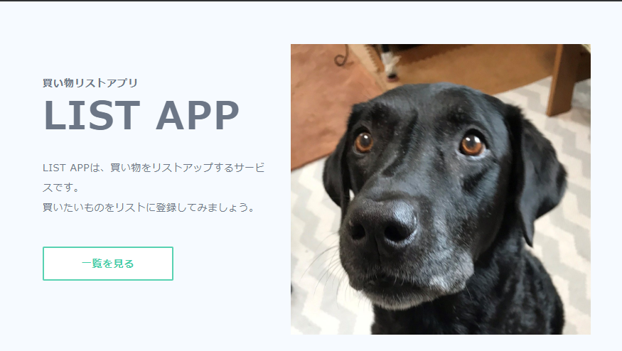
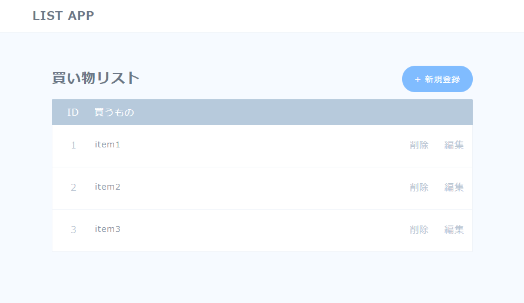

# spartacamp-practice-laravel

## About This App
This is Laravel sample application.
This application provides sample shopping app.




## Requirement
```
# php -v
PHP 7.3.24
# composer -v
   ______
  / ____/___  ____ ___  ____  ____  ________  _____
 / /   / __ \/ __ `__ \/ __ \/ __ \/ ___/ _ \/ ___/
/ /___/ /_/ / / / / / / /_/ / /_/ (__  )  __/ /
\____/\____/_/ /_/ /_/ .___/\____/____/\___/_/
                    /_/
Composer version 2.1.5
```

## SetUp

### Create Project
```
composer create-project laravel/laravel sampleapp
```

### Database
Use MySQL as database (runnning on Docker for Mac).
```
# mysql -u root -p
mysql> create database sampleapp;
mysql> create user sampleapp identified by 'sampleapp';
mysql> grant all on sampleapp.* to sampleapp;
```

## Usage
```
git clone https://github.com/kbanchi-php/spartacamp-practice-laravel.git
cd sampleapp
php artisan serve
```

## How to code

### database config
Edit following files to change database config.
* .env
* config/database.php

### add model
```
php artisan make:model Items --migration
php artisan migrate
```

### add seeder
```
php artisan make:seeder ItemsTableSeeder
```

Edit database/seeders/DatabaseSeeder.php and database/seeders/ItemsTableSeeder.php to add initial data.

```
php artisan migrate:refresh --seed
```

### add TopController and edit routing of Top(/)

```
php artisan make:controller TopController
```

Edit following files to change Top(/) routing.
* routes/web.php
* app/Providers/RouteServiceProvider
* app/Http/Controllers/TopController.php

Add view file.
* resource/views/index.blade.php
* public/css/style.css
* public/images/top.png

### add ListController and edit routing of List(/list)

```
php artisan make:controller ListController
```

Edit following files to change List(/list) routing.
* routes/web.php
* app/Http/Controllers/ListController.php

Add view file.
* resource/views/list.blade.php

### add NewController and edit routing of New(/new)

```
php artisan make:controller NewController
```

Edit following files to change New(/new) routing.
* routes/web.php
* app/Http/Controllers/NewController.php

Add view file.
* resource/views/new.blade.php

### add EditController and edit routing of Edit(/edit)

```
php artisan make:controller EditController
```

Edit following files to change Edit(/edit) routing.
* routes/web.php
* app/Http/Controllers/EditController.php

Add view file.
* resource/views/edit.blade.php

### add Web API

```
php artisan make:controller ItemsAPIController
```

Edit following files to change Web API routing.
* routes/api.php
* app/Http/Controllers/ItemsAPIController.php

## Note
